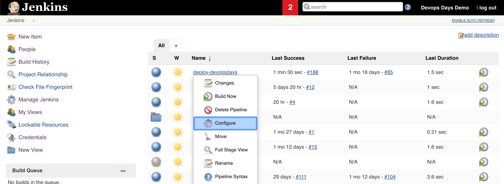
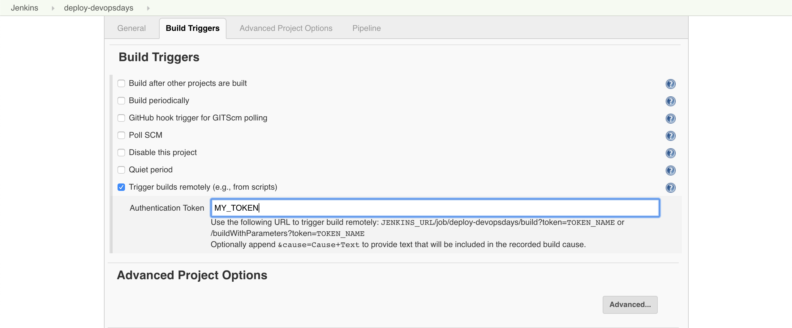
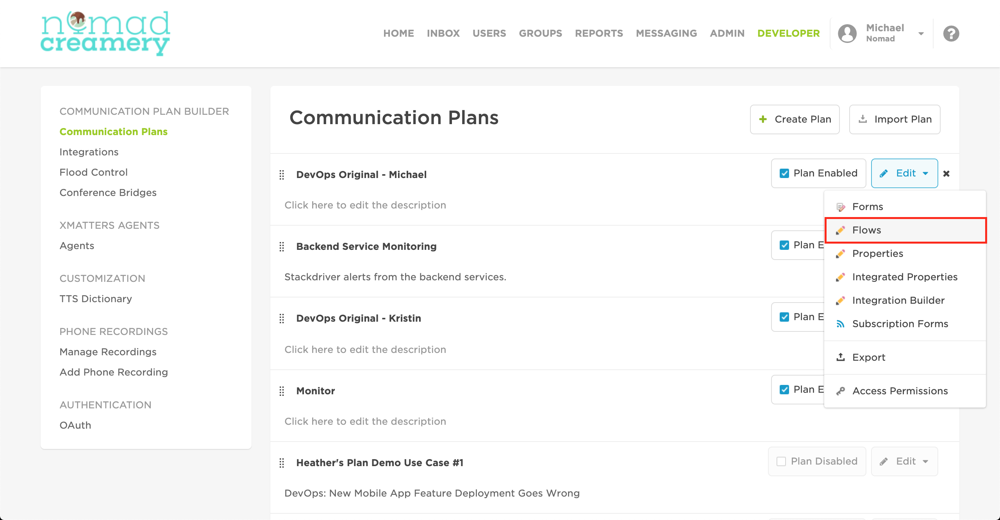
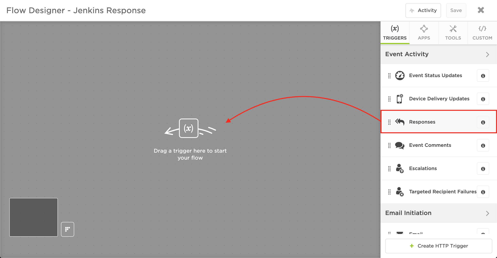
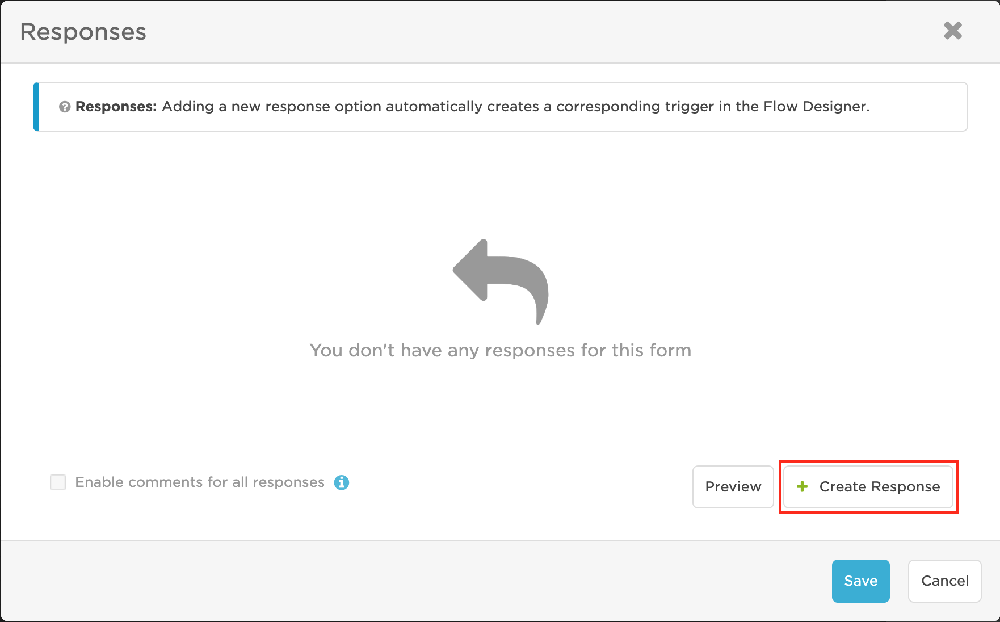
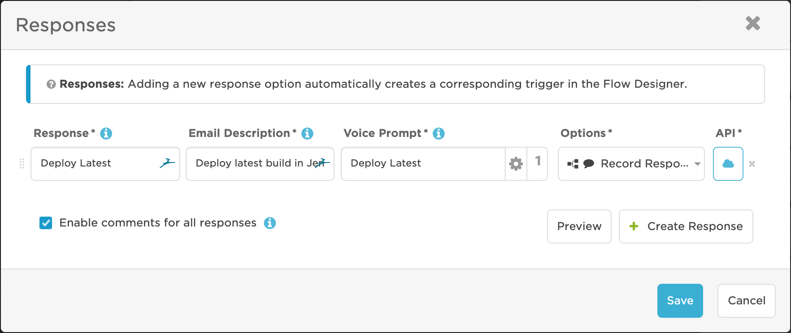
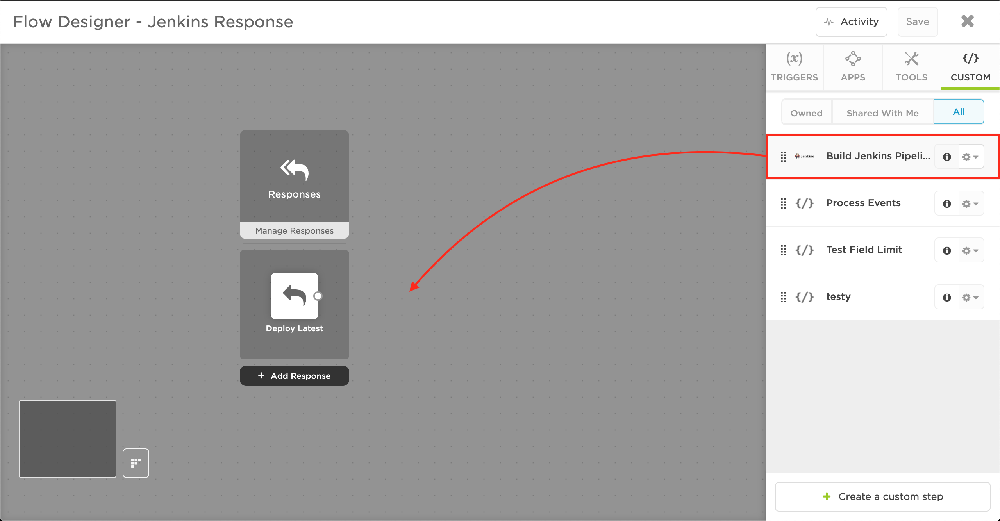
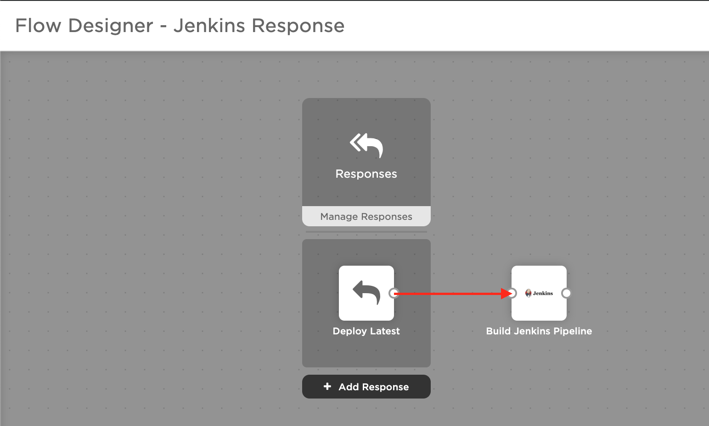

# Jenkins Outbound (from xMatters) integration
This is part of the xMatters Labs awesome listing. For others, see [here](https://github.com/xmatters/xMatters-Labs).

With this library, notification recipients can quickly build a Jenkins Pipeline.

This document details how to install and use this integration. 

---------

<kbd>

</kbd>

---------
# Pre-Requisites
* xMatters account - If you don't have one, [get one](https://www.xmatters.com)! 
* An xMatters Communication Plan with a created form
* Jenkins instance with a pipeline you wish to build from xMatters

# Files
* [script.js](./script.js) - This is the script to paste into the custom step, which creates the meeting and gets the URL

# Introduction - How it works
Jenkins is the leading open source automation server that makes it simple to build, deploy, and automate any project. This integration with xMatters makes it easy to build a Jenkins pipeline directly from an email, furthering Jenkins' automatic capacity.

# Installation
## Prerequisites:
An existing Communication Plan in xMatters for which you would like to add a Jenkins `Create a Meeting` response option

## Getting your Jenkins token
In order to deploy from a pipeline, you need to do a couple things inside your Jenkins instance for each pipeline you wish to automate with xMatters.

1. Navigate to your Jenkins instance
2. Click the dropdown next to your pipeline, then click **Configure**

3. Under the **Build Triggers** section, check the box for `Trigger builds remotely (e.g., from scripts)`, then enter a token and click **Save**

4. Keep this token somewhere, you will be pasting it into xMatters later

## Adding Jenkins to xMatters
1. Inside your xMatters instance, navigate to the Developer tab
2. Locate the Communication Plan you would like to add a Jenkins step to, then click **Edit** > **Flows**

3. For the Form you would like to add Zoom options to (or if you already have a flow, open that flow), click on **Create Flow**
4. Click and drag **Responses** into the flow, then click **Save**

5. Create a new Response by clicking **Add Response** or by double clicking the `Responses` step
6. Click Create Response to add a new response

7. Fill in a new Response that describe a step to build your Jenkins pipeline, then click **Save**

8. On the righthand side, click on the **Custom** tab, then click **+ Create a custom action**
9. In the settings tab, fill out the info as follows, then click **Save**:

| Option                     | Value                                   |
| ---------------------- | ------------------------------- |
| Name                      | Build Jenkins Pipeline         |
| Description             | Builds a pipeline in Jenkins |
| Include Endpoint    | **✓**                                     |
| Endpoint Type        | Basic                                    |
| Endpoint Label       | Jenkins                                |

10. In the inputs tab, add these six inputs, then click **Save**:

| Name | Required Field | Minimum Length | Maximum Length | Help Text | Default Value | Multiline |
| ------- | ---------------- | -------------------- | -------------------- | ----------- | --------------- | --------- |
| Job Name | **✓** | 0 | 2000 | Jenkins Pipeline Name |  |  |
| Token | **✓** | 0 | 2000 | Jenkins Pipeline authentication token |  |  |

11. In the script tab, paste in [this](./script.js) script, then click **Save**
12. Now you've made your custom action, which you can reuse as much as you want, changing the `Job Name` and its corresponding `Token`  to change which Jenkins job is deployed.

## Adding the step to a flow
1. In your flow, click and drag the custom **Build Jenkins Pipeline** action into the flow

2. Connect your Jenkins response option to your custom **Build Jenkins Pipeline** action in the flow

3. In the flow, double click the **Build Jenkins Pipeline** custom step, or click the pencil to edit it
4. Fill in the input values in the **Setup** tab, for example

| Job Name | Token | 
| --- | --- |
| Deploy Latest Build | MY_TOKEN |D

5. In the **Endpoint** tab, click **Create New Endpoint**
6. Fill in the endpoint with the following values, then click **Save Changes**

| Name | Base URL | Trust self-signed certficiates | Authentication Type | Username | Password |
| --- | --- | --- | --- | --- | --- |
| Jenkins | MY_JENKINS_URL | | Basic | MY_JENKINS_USERNAME | MY_JENKINS PASSWORD |

7. Close out of the endpoint editor, then click OK to save the custom step, then click **Save** to save the flow
8. Enjoy automagic :)

# Testing
To test the integration, fire the xMatters outbound notifier and select the Jenkins response option. If it works, the pipeline will run, which you can see either in Jenkins or in whatever the Jenkins pipeline is supposed to do.

# Troubleshooting
If the integration is not working properly, there are a few places where it could be going wrong.
1. Check that the `Job Name` input in xMatters matches a valid Jenkins pipeline, for example, in the screenshot below, the job name would be `deploy-devopsdays`

2. Double check that you have the `Trigger builds remotely (e.g., from scripts)` checked, and that your token matches the one you put in the `Token` input in xMatters.
3. Check the activity log in xMatters, by going to the Flow Designer, then clicking on **Activity** in the top righthand corner. Click on the Jenkins step, then click on **Log**. If you see a 200 Response, then a 403 Forbidding, this means that something is wrong with your token so double check you have token right (it is case sensitive). Otherwise, seek help from an xPert
